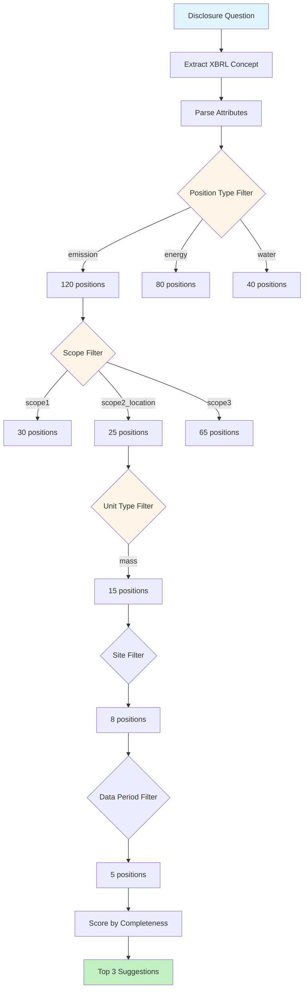
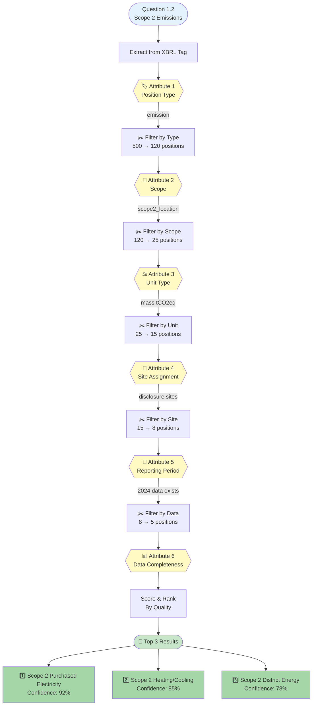
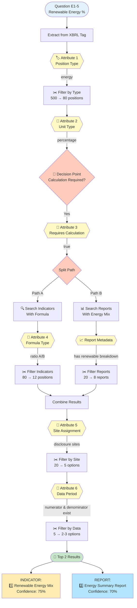
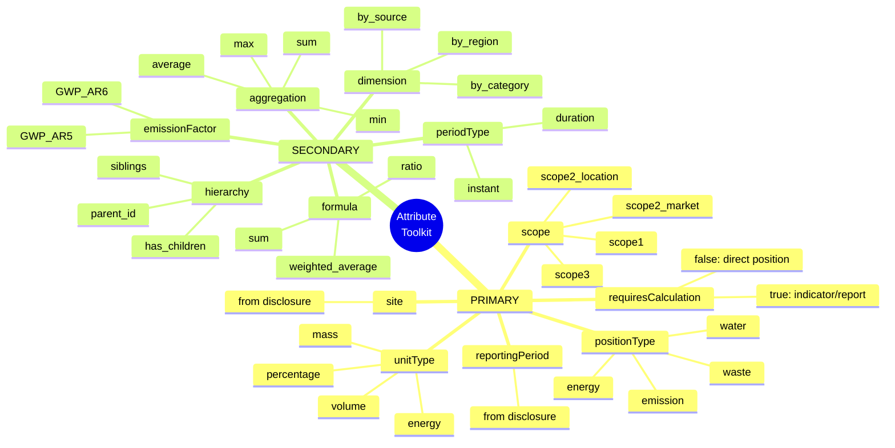
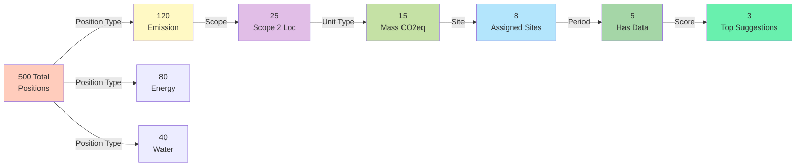
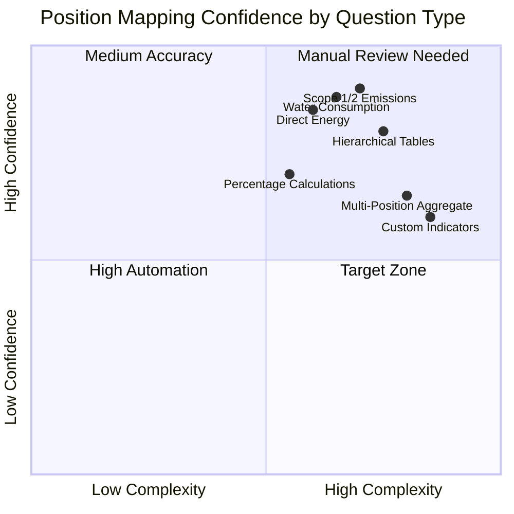
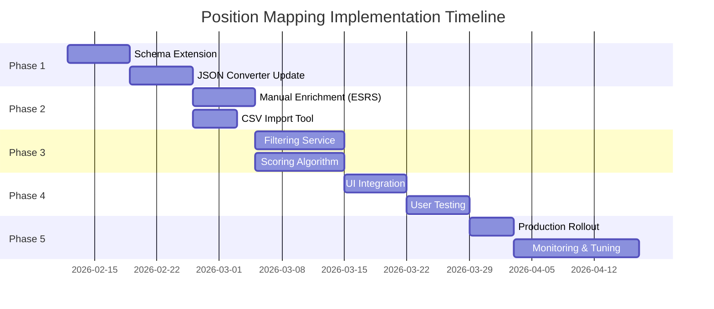

# Position Mapping Decision Tree - Visual Diagrams

**Document Version:** 1.0  
**Date:** February 12, 2026  
**Purpose:** Visual decision tree diagrams for position mapping (optimized for export to images)

---

## Overview Diagram



---

## Example 1: Scope 2 GHG Emissions (Location-Based)

### Question Details Box

```
╔═══════════════════════════════════════════════════════════════╗
║  QUESTION 1.2: Gross Scope 2 Location-Based GHG Emissions    ║
║  XBRL: esrs:GrossLocationBasedScope2GreenhouseGasEmissions   ║
║  Unit: tCO2eq                                                 ║
║  Type: Number                                                 ║
║  Mandatory: Yes                                               ║
╚═══════════════════════════════════════════════════════════════╝
```

### Decision Flow with Mermaid



### Attribute Toolkit Table

```
┏━━━━━━━━━━━━━━━━━━━━┳━━━━━━━━━━━━━━━━━━━━━┳━━━━━━━━━━━━━━━━━━━━━┓
┃ ATTRIBUTE          ┃ VALUE               ┃ FILTER RESULT       ┃
┡━━━━━━━━━━━━━━━━━━━━╇━━━━━━━━━━━━━━━━━━━━━╇━━━━━━━━━━━━━━━━━━━━━┩
│ 1. Position Type   │ emission            │ 500 → 120 positions │
│ 2. Scope           │ scope2_location     │ 120 → 25 positions  │
│ 3. Unit Type       │ mass                │ 25 → 15 positions   │
│ 4. Site            │ [Site A, Site B]    │ 15 → 8 positions    │
│ 5. Reporting Period│ 2024-01 to 2024-12  │ 8 → 5 positions     │
│ 6. Completeness    │ Score & Rank        │ 5 → 3 suggestions   │
└────────────────────┴─────────────────────┴─────────────────────┘
```

---

## Example 2: Renewable Energy Percentage

### Question Details Box

```
╔═══════════════════════════════════════════════════════════════╗
║  QUESTION E1-5: Percentage of Renewable Energy               ║
║  XBRL: esrs:PercentageOfEnergyConsumptionFromRenewableSources║
║  Unit: %                                                      ║
║  Type: Calculated (Indicator or Report)                      ║
║  Mandatory: Yes                                               ║
╚═══════════════════════════════════════════════════════════════╝
```

### Decision Flow with Mermaid



### Dual Path Visualization

```
                    ┌─────────────────────────────────┐
                    │  Calculation Required = TRUE     │
                    └──────────────┬──────────────────┘
                                   │
                    ┌──────────────┴──────────────┐
                    │                             │
         ┌──────────▼──────────┐      ┌─────────▼──────────┐
         │   PATH A:           │      │   PATH B:          │
         │   Indicators        │      │   Reports          │
         └──────────┬──────────┘      └─────────┬──────────┘
                    │                           │
         ┌──────────▼──────────┐      ┌─────────▼──────────┐
         │ Look for Formula    │      │ Look for Energy    │
         │ Type: ratio (A/B)   │      │ Mix Breakdown      │
         └──────────┬──────────┘      └─────────┬──────────┘
                    │                           │
         ┌──────────▼──────────┐      ┌─────────▼──────────┐
         │ 12 Indicators       │      │ 8 Reports          │
         │ Found               │      │ Found              │
         └──────────┬──────────┘      └─────────┬──────────┘
                    │                           │
                    └──────────┬────────────────┘
                               │
                    ┌──────────▼──────────┐
                    │  Merge & Filter     │
                    │  by Site + Period   │
                    └──────────┬──────────┘
                               │
                    ┌──────────▼──────────┐
                    │  Final: 2-3 Options │
                    └─────────────────────┘
```

---

## Example 3: Total Energy Consumption (Table with Hierarchy)

### Question Details Box

```
╔═══════════════════════════════════════════════════════════════╗
║  QUESTION E1-4: Total Energy Consumption by Source           ║
║  XBRL: esrs:TotalEnergyConsumption                           ║
║  Format: Table (Source | MWh | %)                            ║
║  Type: Hierarchical with breakdown                           ║
║  Mandatory: Yes                                               ║
╚═══════════════════════════════════════════════════════════════╝
```

### Decision Flow with Mermaid



```mermaid
flowchart TD
    Start([Question E1-4<br/>Energy Consumption Table]) --> Extract[Extract from XBRL Tag]
    
    Extract --> Attr1{{"🏷️ Attribute 1<br/>Position Type"}}
    Attr1 -->|energy| Filter1["✂️ Filter by Type<br/>500 → 80 positions"]
    
    Filter1 --> Attr2{{"⚖️ Attribute 2<br/>Unit Type"}}
    Attr2 -->|energy MWh, GJ| Filter2["✂️ Filter by Unit<br/>80 → 60 positions"]
    
    Filter2 --> Attr3{{"📊 Attribute 3<br/>Dimension"}}
    Attr3 -->|by_source| Decision{"🤔 Decision Point<br/>Grouped or Individual?"}
    
    Decision -->|Grouped| PathA["🌳 PATH A:<br/>Parent Position"]
    Decision -->|Individual| PathB["📋 PATH B:<br/>Multiple Positions"]
    
    PathA --> HierarchyA{{"🏗️ Attribute 4a<br/>Has Children?"}}
    HierarchyA -->|yes| FilterA["✂️ Find Parent with<br/>Child Positions"]
    
    PathB --> HierarchyB{{"🔗 Attribute 4b<br/>Same Parent?"}}
    HierarchyB -->|siblings| FilterB["✂️ Find Siblings<br/>Under Same Parent"]
    
    FilterA --> Merge[Combine Results]
    FilterB --> Merge
    
    Merge --> Attr5{{"📍 Attribute 5<br/>Site Assignment"}}
    Attr5 -->|disclosure sites| Filter5["✂️ Filter by Site<br/>15 → 8 groups"]
    
    Filter5 --> Attr6{{"📅 Attribute 6<br/>Data Period"}}
    Attr6 -->|all children have data| Filter6["✂️ Filter by Data<br/>8 → 3 groups"]
    
    Filter6 --> Score["Score by<br/>Data Completeness"]
    
    Score --> Result([🎯 Best Match])
    
    Result --> R1["🌳 Total Energy Consumption 95%<br/>├─ Renewable Energy ✓<br/>├─ Fossil Fuel Energy ✓<br/>└─ Nuclear Energy ✓"]
    
    style Start fill:#e3f2fd
    style Result fill:#c8e6c9
    style R1 fill:#a5d6a7
    style Decision fill:#ffccbc
    style PathA fill:#b3e5fc
    style PathB fill:#b3e5fc
    style Attr1 fill:#fff9c4
    style Attr2 fill:#fff9c4
    style Attr3 fill:#fff9c4
    style HierarchyA fill:#fff9c4
    style HierarchyB fill:#fff9c4
    style Attr5 fill:#fff9c4
    style Attr6 fill:#fff9c4
```

### Hierarchical Structure Visualization

```
┏━━━━━━━━━━━━━━━━━━━━━━━━━━━━━━━━━━━━━━━━━━━━━━━━━━━━━━━━━━━━━┓
┃  PARENT POSITION: Total Energy Consumption                   ┃
┃  Unit: MWh | Type: energy | Has Children: Yes                ┃
┗━━━━━━━━━━━━━━━━━━━━━━━━━━━━━━━━━━━━━━━━━━━━━━━━━━━━━━━━━━━━━┛
                              │
          ┌───────────────────┼───────────────────┐
          │                   │                   │
┏━━━━━━━━━▼━━━━━━━━━┓ ┏━━━━━━▼━━━━━━━━┓ ┏━━━━━━▼━━━━━━━━┓
┃ CHILD 1:          ┃ ┃ CHILD 2:       ┃ ┃ CHILD 3:       ┃
┃ Renewable Energy  ┃ ┃ Fossil Fuel    ┃ ┃ Nuclear Energy ┃
┃ 15,000 MWh        ┃ ┃ 45,000 MWh     ┃ ┃ 10,000 MWh     ┃
┃ Data: ✓ Complete  ┃ ┃ Data: ✓ Complete┃ ┃ Data: ✓ Complete┃
┗━━━━━━━━━━━━━━━━━━━┛ ┗━━━━━━━━━━━━━━━━┛ ┗━━━━━━━━━━━━━━━━┛
          │                   │                   │
    ┌─────┴─────┐       ┌─────┴─────┐            │
    │           │       │           │            │
┌───▼───┐   ┌───▼───┐ ┌─▼─┐     ┌───▼───┐      │
│ Solar │   │ Wind  │ │Coal│     │Natural│      │
│ PV    │   │ Farm  │ │    │     │ Gas   │      │
└───────┘   └───────┘ └────┘     └───────┘      │
```

---

## Complete Attribute Toolkit (Visual Reference)



---

## Filtering Progression Chart



---

## Success Metrics Dashboard

```
┏━━━━━━━━━━━━━━━━━━━━━━━━━━━━━━━━━━━━━━━━━━━━━━━━━━━━━━━━━━━━━┓
┃                    SUCCESS METRICS DASHBOARD                  ┃
┗━━━━━━━━━━━━━━━━━━━━━━━━━━━━━━━━━━━━━━━━━━━━━━━━━━━━━━━━━━━━━┛

┌─────────────────────────────────────────────────────────────┐
│ Position Reduction                                          │
├─────────────────────────────────────────────────────────────┤
│ Before: ████████████████████████████████████ 100+ positions│
│ After:  ███ 1-5 positions                                   │
│ Target: 80% reduction ✓                                     │
└─────────────────────────────────────────────────────────────┘

┌─────────────────────────────────────────────────────────────┐
│ Auto-Match Accuracy                                         │
├─────────────────────────────────────────────────────────────┤
│ High Confidence:   ████████████████ 70%                     │
│ Medium Confidence: ████████ 20%                             │
│ Low Confidence:    ███ 10%                                  │
│ Target: 80%+ accuracy ✓                                     │
└─────────────────────────────────────────────────────────────┘

┌─────────────────────────────────────────────────────────────┐
│ User Override Rate                                          │
├─────────────────────────────────────────────────────────────┤
│ Accepted Top Suggestion: ████████████████████ 82%          │
│ Override to #2 or #3:    ████ 13%                          │
│ Manual Selection:        █ 5%                              │
│ Target: <20% override ✓                                     │
└─────────────────────────────────────────────────────────────┘
```

---

## Question Type Coverage Matrix



---

## Implementation Roadmap Gantt



---

## Export Instructions

### For PNG/SVG Export:

1. **Mermaid Diagrams:** 
   - Copy each mermaid block
   - Use: https://mermaid.live or GitHub markdown preview
   - Export as PNG or SVG

2. **ASCII Diagrams:**
   - Use monospace font (Courier New, Consolas)
   - Screenshot or convert to image

3. **Recommended Tools:**
   - Mermaid Live Editor: https://mermaid.live
   - Markdown Preview Enhanced (VSCode extension)
   - Carbon (for code screenshots): https://carbon.now.sh

### For Presentation:

- **PowerPoint/Keynote:** Import SVG exports
- **Confluence/Wiki:** Paste mermaid code directly (if supported)
- **Documentation:** Use markdown with mermaid rendering

---

**Document Status:** Visual Export Ready  
**Optimized For:** Presentations, Documentation, Technical Reviews
